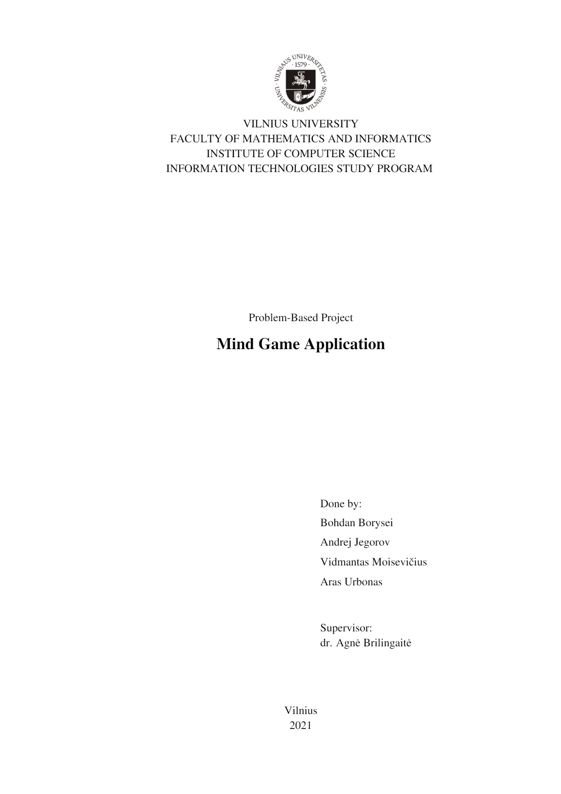

# 1. Purpose of the system

## 1.1 Users

_**Anonymous user** -  user that has not logged into the application. Initially all users, apart from the developers, will be anonymous (while the login system is not properly implemented)._

_**_Authorized user_** - user that has logged into the application, this will provide more functionality in the application in comparison to being anonymous._

_**_Developer/Tester_** - user that takes part in the development or testing of the application, has all the privileges._

## 1.2 Location
Initially: Team’s “Anekdotas” GitLab repository
Eventually (upon the main release): The Google Play app store for Android

## 1.3 Responsibilities
	
##### The primary responsibilities of the system:
- Provide the user with interactive quiz levels.
- Be able to effectively engage with the user by providing a different environment than most applications of such kind.
- Provide the user with interesting and engaging content in the form of fun, thought provoking quiz questions.
- Allow access to levels based on user profile achievements.

##### Secondary responsibilities of the system:
- Allow users to get ingame currency by completing levels.
- Allow authorized users to buy “power-ups” and “upgrades” with ingame currency.

## 1.4 Need

This system is needed in order to bring entertainment for the users and to increase diversity among quiz apps.

# 2. High-level overview of the system

The system will be of a client-server type that contains:
- The Android Quiz App - a mobile client-side application with a functional user interface that enables users to play levels. 
- The Web Server - a server, which can facilitate the communication between the mobile application and the database.
- The Database - a relational database which stores quiz levels, user data and other relevant information.

# 3. Functional Requirements

## 3.1 High Priority
- As a “Mind Game” app player, I want to select a set of questions by choosing a topic, so I can select  topics based on my knowledge.
- As a “Mind Game” app player, I want to see my statistics: number of topics completed, percentage of correct answers, time spent on question. This way I can track my progress.
- As a “Mind Game” app player, I want my progress to be saved every time I finish a set of questions, so that I do not have to answer the same questions repetitively.
- As a developer of the “Mind Game” app, I would like to easily add new sets of questions without the need of editing the client-side (mobile) application code.

## 3.2 Medium Priority
- As a “Mind Game” app player, I want to experience picture guessing and audio questions. This will make my experience more varied, joyful and engaging.  
- As a “Mind Game” app player, I want to see how other users rated question sets, so I can better decide what question set I want to select.
- As an authorized “Mind Game” app player, I can continue playing on different devices and have my progress synced between them.
- As an authorized “Mind Game” app player, I want to be able to see other players' statistics, so I can have fun competing with others.
- As an authorized “Mind Game” app player, I want to share sets of text questions created by me, so that  other players can get a better experience.
- As an authorized “Mind Game” app player, I want to rate the question sets I complete, so I can influence the ratings that other players see.

## 3.3 Low Priority
- As a “Mind Game” app player, who is a non-native English speaker, I would like the application to have the ability to switch to Lithuanian or Russian languages and have ability to select separate sets of questions for my language.
- As a “Mind Game” app player, I want to create my own sets of audio and picture questions inside the app and share the sets, so other players can see them and play.
- As a “Mind Game” app player I want to get have short videos along with my questions in order to make my experience more diverse.

	
# 4. Non-Functional requirements

## 4.1 Compatibility:
- The mobile app must be able to run on Android 6.0 or greater.
- Implement unicode compatibility in every step of the system: users must be able to type, submit and see non-latin characters.
- The system must run in VU infrastructure.

## 4.2 Reliability: 
- The system should not have any bugs or issues that prevent the player from having an enjoyable, non-frustrating experience.

## 4.3 Security:
- The database and the server should be in separate Virtual Machines due to security reasons.
- Avoid real names, cell phone number and other data that could personally identify a player.

## 4.4 Performance: 
- Topic loading should be optimized in such a way that on a 3G clients’ internet connection, a topic should not take more than 20 seconds to load.
